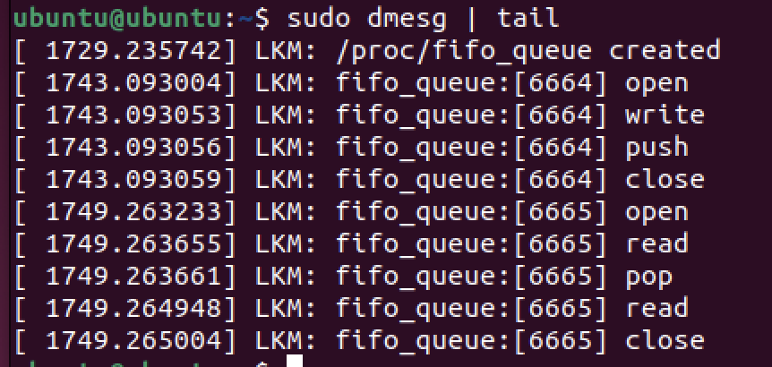

Statically define the mutex
lock and unlock with both push and pop
from slides:
- fastpath: which is to check if mutex is already acquired and has on
owner or not. If the owner is NULL, then the mutex is acquired.
- midpath: aka optimistic spinning, tries to spin for acquisition while
the lock owner is running and there are no other tasks ready to run
that have higher priority.
The rationale is that if the lock owner is running, it is likely to release
the lock soon.
- slowpath: last resort, if the lock is still unable to be acquired, the
task is added to the wait-queue and sleeps until woken up by the
unlock path.

can sleep, only needs protection when pushing and popping so we can use mutexes instead of semaphores or spin locks.
also lock clean up

in the logs we can see the push and pop, in another temrinal we echo and cat for the entries.