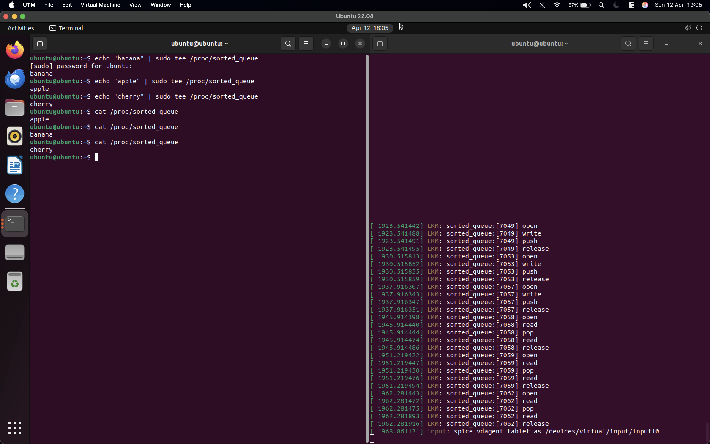

both first and the tree's structure need protecting from concurrent writes and reads.
Same thing as the fifo queue, we can use mutexes here.
first is protected and computed after balancing.
protect clean up too.

in the logs we can see the push and pop, in another temrinal we echo and cat for the entries. we can see that apple is the first cat even when it was the second echo.