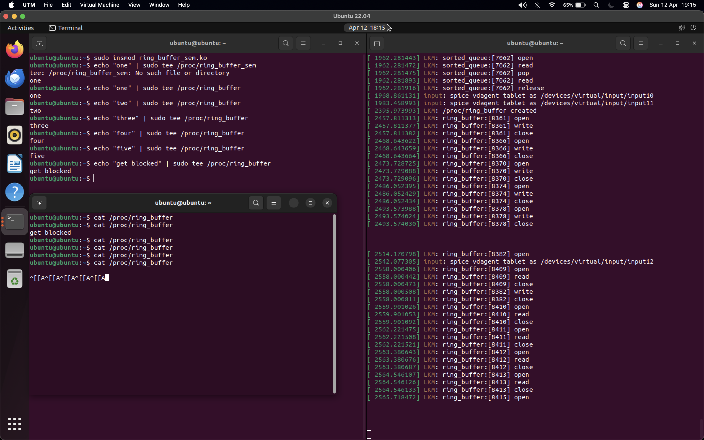
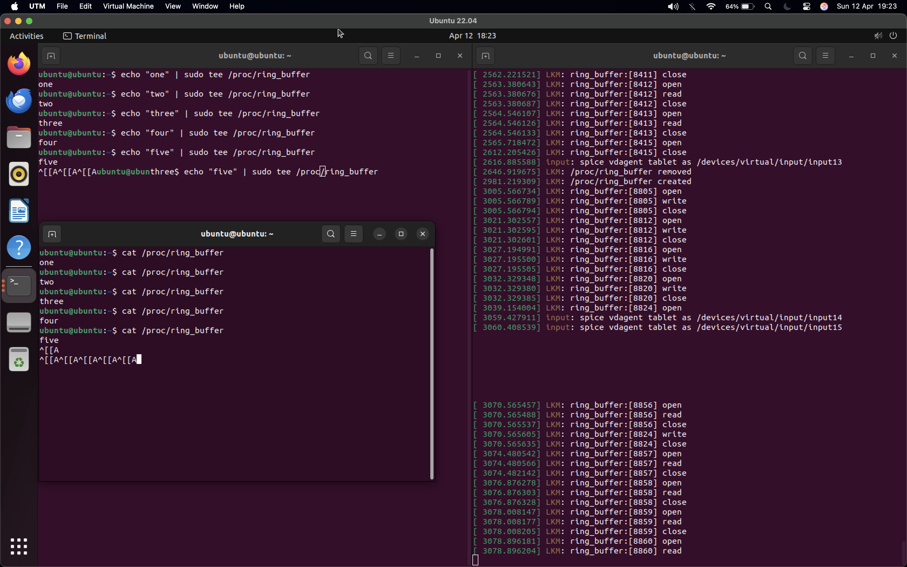

wait queue solution also uses a mutex for protecting the data since the wait queue does not guarantee another thread doesn't read or write as soon as the thread wakes.
remove data override, since a wait is now implemented, no need to override data (would defeat the purpose of waiting for space).

Semaphore

in the logs we can see where the ring_buffer opens and doesn't read due to the semaphore blocking. The final log is the same thing but for reading (see the smaller terminal blocked on cat).

Wait Queue

same thing here for the wait queue version but this time I remembered to also click "up_arrow" to show the echo also blocked and then unblocked after the cat reads (see the inlined command line after the "^[[A").