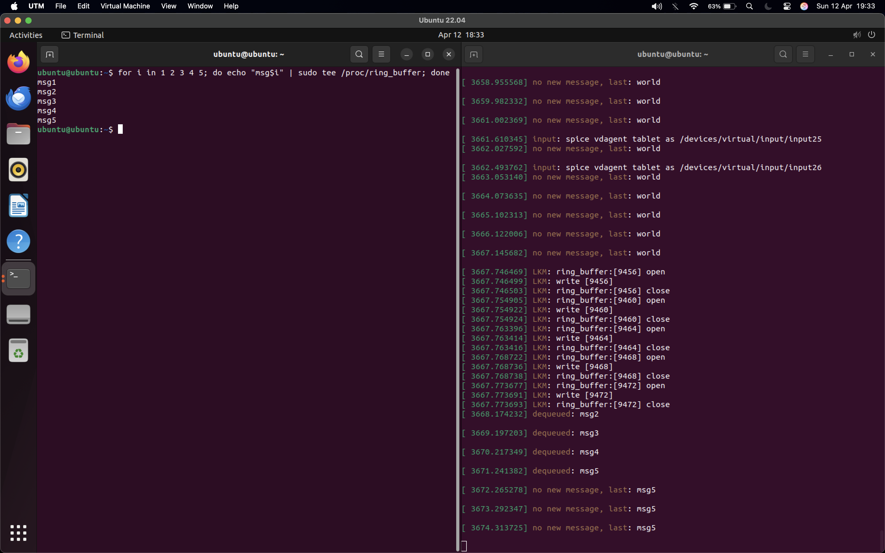

timer runs in softirp context so lock with a spinlock
spin_lock_irqsave to disable interrupts

here we can see a previous last word from a "hello world" test, then we run a loop to quickly fill up the buffer. Then the dequeues happen with the timer (see the green text).