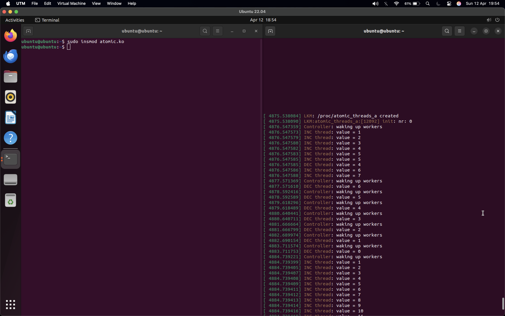

controller thread wakes up other 2 threads, using mssleep to wait 1sec.
using a wait queue

on adding the module we see the nr starts at 0, then its incremented, with the workers waking up and decrementing, repeating this process.